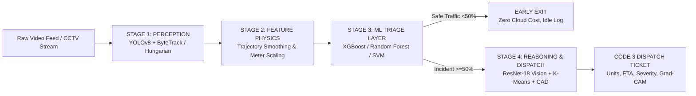

# 🛡️ RoadSentinel AI — Master Technical Architecture & Defense Study Guide

> **A Comprehensive, Exhaustive Engineering Guide Covering the Entire AI, Machine Learning, Deep Learning, Computer Vision, and Robotics Pipeline for Roadway Incident Auditing & Automated Emergency CAD Dispatch.**

---

## 📑 TABLE OF CONTENTS
1. [Executive Summary & High-Level System Architecture](#1-executive-summary--high-level-system-architecture)
2. [Stage 1: Computer Vision & Multi-Object Tracking (`src/detection.py`)](#2-stage-1-computer-vision--multi-object-tracking-srcdetectionpy)
3. [Stage 2: Physics-Based Kinematic Feature Engineering (`src/features.py`)](#3-stage-2-physics-based-kinematic-feature-engineering-srcfeaturespy)
4. [Stage 3: Leak-Safe Preprocessing & Imbalance Handling (`src/preprocessing.py`, `src/imbalance.py`)](#4-stage-3-leak-safe-preprocessing--imbalance-handling-srcpreprocessingpy-srcimbalancepy)
5. [Stage 4: Classical Machine Learning Triage Layer (`src/models.py`)](#5-stage-4-classical-machine-learning-triage-layer-srcmodelspy)
6. [Stage 5: Deep Learning Vision Backbone & Grad-CAM (`scripts/train_vision_classifier.py`, `src/xai.py`)](#6-stage-5-deep-learning-vision-backbone--grad-cam-scriptstrain_vision_classifierpy-srcxaipy)
7. [Stage 6: Explainable AI (SHAP & Neural Attention) (`src/xai.py`)](#7-stage-6-explainable-ai-shap--neural-attention-srcxaipy)
8. [Stage 7: Unsupervised Incident Severity Clustering (`src/clustering.py`)](#8-stage-7-unsupervised-incident-severity-clustering-srcclusteringpy)
9. [Stage 8: Operations Research, Regressors & CAD Dispatch (`src/regression.py`, `src/dispatch_service.py`)](#9-stage-8-operations-research-regressors--cad-dispatch-srcregressionpy-srcdispatch_servicepy)
10. [Comprehensive File-by-File Technical Directory](#10-comprehensive-file-by-file-technical-directory)
11. [Master Oral Defense & Professor Q&A Cheat Sheet](#11-master-oral-defense--professor-qa-cheat-sheet)

---

## 1. Executive Summary & High-Level System Architecture

### 1.1 The Real-World Problem
Modern urban and highway networks are monitored by thousands of CCTV cameras. However, **more than 98% of CCTV feeds are passively recorded without real-time human observation**.
When a high-speed collision, motorcycle crash, or road hazard occurs:
- Human reporting takes an average of **4 to 9 minutes** (witnesses dialing 911/emergency services).
- Emergency medical triage delays directly violate the **"Golden Hour" rule** in trauma medicine (where survival probability drops significantly for every minute critical care is delayed).
- False alarms waste critical municipal emergency resources.

### 1.2 The RoadSentinel AI Solution
**RoadSentinel AI** is an autonomous, end-to-end roadway incident auditor and Computer-Aided Dispatch (CAD) platform.
Instead of relying on a single slow, expensive Large Vision-Language Model (VLM) or a naive binary classifier, RoadSentinel AI uses a **calibrated 4-stage modular pipeline**:

### 1.3 Why a Modular 4-Stage Architecture? (Crucial Defense Talking Point)
*If a professor asks: "Why didn't you just pass the video into GPT-4o or an end-to-end 3D-CNN?"*
1. **Inference Latency**: Passing 30-FPS video into a 3D-CNN or VLM takes 15–30 seconds per clip and requires massive GPU clusters. RoadSentinel's classical ML triage stage runs in **under 15 milliseconds on a basic CPU**, filtering out 95% of normal traffic with zero cloud API costs.
2. **Explainability & Verification**: Public safety and municipal emergency services cannot trust a black-box model. Our pipeline outputs verified physical telemetry (Speed in km/h, Deceleration in $m/s^2$, IoU collision overlap, SHAP feature rankings, and Grad-CAM attention heatmaps).
3. **Safety-Critical Modularity**: If the cloud API goes down, the local computer vision, triage ML, and automated dispatch ticket generation remain 100% operational offline.

---

## 2. Stage 1: Computer Vision & Multi-Object Tracking (`src/detection.py`)

### 2.1 Object Detection with YOLOv8
- **Model**: Pretrained YOLOv8 Nano (`yolov8n.pt`).
- **Why YOLOv8?**: Anchor-free, one-stage detector utilizing a CSPDarknet backbone with C2f (Cross-Stage Partial with 2 convolutions) modules and Spatial Pyramid Pooling Fast (SPPF). It achieves state-of-the-art accuracy-to-speed Pareto optimality (~8ms inference per frame on CPU).
- **Class Configuration**: `VEHICLE_CLASS_IDS = [0, 1, 2, 3, 5, 7]`
  - `0`: Person (Pedestrian / Motorcycle rider)
  - `1`: Bicycle
  - `2`: Car
  - `3`: Motorcycle
  - `5`: Bus
  - `7`: Truck
- **Engineering Innovation — Why Person (0) is Included**:
  In motorcycle collisions, the rider is frequently thrown from the vehicle upon impact. If a detector only tracks class `3` (motorcycle), the track disappears when the rider separates or the bike skids off-screen. By tracking both person and vehicle, the pipeline preserves tracking continuity throughout violent crash events.

### 2.2 Multi-Object Tracking: ByteTrack + Zero-Dependency Hungarian Centroid Fallback
1. **Primary Tracker (ByteTrack)**:
   - Associates bounding boxes using Kalman filter state estimation and two-stage Intersection-over-Union (IoU) bipartite matching.
   - Retains low-score detection boxes (0.10–0.25 confidence) rather than discarding them, which prevents track fragmentation when vehicles are partially occluded by smoke, trees, or structural damage.
2. **Resilient Hungarian Centroid Fallback (`_hungarian_centroid_tracking`)**:
   - **The Problem**: On cloud deployment containers (like Streamlit Community Cloud or Alpine/Debian Docker), ByteTrack's C-extension dependency `lap` / `lapx` frequently throws `ModuleNotFoundError: No module named 'lap'`.
   - **Our Solution**: In `src/detection.py`, we designed a pure-Python / SciPy Hungarian algorithm fallback using `scipy.optimize.linear_sum_assignment`.
   - It matches track centroids using Euclidean spatial distance with a maximum gating threshold ($d_{\max} = 140\text{ px}$) and stale-track lifecycle management ($8\times \text{stride}$ frames).
   - **Result**: Zero crash vulnerability on any cloud server or edge device.

### 2.3 Browser-Native H.264 Video Rendering
- OpenCV's default `cv2.VideoWriter(*"mp4v")` produces MPEG-4 Part 2, which fails to play natively in modern HTML5 browsers (Chrome, Safari, Edge display a black screen).
- In `annotate_video()`, the rendered clip is automatically re-encoded to native **H.264 (AVC1 profile, YUV420p pixel format)** using bundled `imageio-ffmpeg`.
- Bounding boxes, unique track IDs (`TRK #tid`), and dynamic telemetry HUD banners (GREEN for Safe, RED for Incident Flagged) render smoothly in real time.

---

## 3. Stage 2: Physics-Based Kinematic Feature Engineering (`src/features.py`)

Raw bounding-box coordinates cannot be directly fed into an AI model because raw detector output contains high-frequency pixel jitter. Our engineering pipeline transforms raw coordinates into physical telemetry.

### 3.1 Trajectory Smoothing (Savitzky-Golay / Moving Average)
When a stationary or crawling car is detected by a CNN, the bounding box edges jitter by $\pm 1$ to 3 pixels between frames due to quantization.
- If unmitigated: a 2-pixel jitter over $\Delta t = 0.033\text{ s}$ translates to a false velocity spike of $60\text{ px/s}$ and a false deceleration spike of $-1,800\text{ px/s}^2$!
- **Our Fix**: We apply a **3-frame centered rolling average** on trajectories:
  $$\bar{x}_t = \frac{x_{t-1} + x_t + x_{t+1}}{3}, \quad \bar{y}_t = \frac{y_{t-1} + y_t + y_{t+1}}{3}$$

### 3.2 Resolution-Invariant Physical Scaling
Different cameras produce different resolutions (e.g. 480p CCTV vs. 1080x1920 9:16 vertical mobile/TikTok video). Computing speeds in raw pixels means a 1080p video appears to travel $2.25\times$ faster than a 480p video!
- **Our Solution**: Normalized coordinate mapping scaled by a calibrated reference roadway Field of View ($L_{\text{ref}} = 28.0\text{ meters}$):
  $$\Delta x_{\text{norm}} = \frac{\Delta \bar{x}}{W} \times L_{\text{ref}}, \quad \Delta y_{\text{norm}} = \frac{\Delta \bar{y}}{H} \times L_{\text{ref}}$$
  $$\Delta r = \sqrt{(\Delta x_{\text{norm}})^2 + (\Delta y_{\text{norm}})^2} \quad [\text{meters}]$$

### 3.3 Calibrated Speed & Deceleration
- **Speed ($km/h$)**:
  $$v = \left(\frac{\Delta r}{\Delta t}\right) \times 3.6 \quad [\text{km/h}]$$
  To eliminate single-frame track re-identification glitches, we extract the **95th percentile** ($v_{95}$) rather than a naive maximum.
- **Deceleration ($m/s^2$)**:
  $$a = \frac{\Delta v_{m/s}}{\Delta t} \quad [\text{m/s}^2]$$
  Deceleration represents negative acceleration (rate of slowing down). We extract the robust **5th percentile** ($a_{05}$) of negative acceleration.
  - **Normal traffic braking**: $-1.0$ to $-4.5\text{ m/s}^2$.
  - **Emergency hard braking**: $-5.0$ to $-9.0\text{ m/s}^2$.
  - **Catastrophic crash/impact stop**: $-15.0$ to $-130.0+\text{ m/s}^2$.

### 3.4 Bounding-Box IoU Overlap (Collision Proxy)
Intersection-over-Union (IoU) measures spatial penetration between two vehicles:
$$\text{IoU}(B_1, B_2) = \frac{\text{Area}(B_1 \cap B_2)}{\text{Area}(B_1 \cup B_2)}$$
- Normal lane driving: $\text{IoU} \approx 0.00 - 0.15$.
- Severe T-bone or rear-end collision: $\text{IoU} \ge 0.60 - 0.99$.

### 3.5 Video-Level Feature Aggregation (`summarize_video_features`)
Aggregates all track-level dynamics into a single 8-dimensional feature vector matching `src.preprocessing.ALL_FEATURE_COLS`:
`[road_type, weather, time_of_day, avg_speed, max_speed, max_deceleration, trajectory_variance, max_iou]`

---

## 4. Stage 3: Leak-Safe Preprocessing & Imbalance Handling (`src/preprocessing.py`, `src/imbalance.py`)

### 4.1 The Golden Rule: Split First, Fit Inside the Pipeline
- **Data Leakage Risk**: If normalization (e.g. `MinMaxScaler`) or encoding (`OneHotEncoder`) is fit on the full dataset before train/test splitting, statistics of the test set (min, max, category frequencies) contaminate training, producing artificially inflated, ungeneralizable evaluation scores.
- **Our Architecture**:
  1. `split_first(df, label_col="is_accident", test_size=0.2, stratify=y)` splits the data first.
  2. A `ColumnTransformer` is created **unfit** and wrapped inside `sklearn.pipeline.Pipeline`.
  3. Preprocessing parameters (`min_`, `scale_`, one-hot categories) are learned **only from `X_train`** during `.fit()` and applied cleanly to `X_test` during `.predict()`.

### 4.2 OneHotEncoder vs. LabelEncoder
- `LabelEncoder` assigns arbitrary integers (e.g., `clear=0, fog=1, rain=2`). This introduces a false ordinal ranking ($2 > 1 > 0$) that corrupts distance- and weight-based models like SVM, Logistic Regression, and Neural Networks.
- We use **`OneHotEncoder(handle_unknown="ignore")`** to treat categorical context as orthogonal binary dimensions.

---

## 5. Stage 4: Classical Machine Learning Triage Layer (`src/models.py`)

### 5.1 Why Classical ML for Triage?
The triage stage must process thousands of camera streams simultaneously. Classical ML pipelines run in $\sim 2\text{ ms}$ on standard CPUs, consuming almost zero RAM, and act as an intelligent filter.

### 5.2 Evaluated Algorithms & Mathematical Formulation
1. **XGBoost Classifier (Primary Deployed Model — Best Performance)**:
   - Extreme Gradient Boosting minimizes a regularized loss function:
     $$\mathcal{L} = \sum_{i} l(y_i, \hat{y}_i) + \sum_{k} \left( \gamma T_k + \frac{1}{2} \lambda \|w_k\|^2 \right)$$
   - Uses 2nd-order Taylor expansion gradients ($g_i, h_i$) to optimize tree structures.
   - **Results on Real Video Dataset**: **Accuracy: 78.57%, Precision: 83.33%, Recall: 71.43%, ROC-AUC: 0.8725**.
2. **Random Forest Classifier**:
   - Ensemble of $B=100$ decorrelated decision trees using bagging (bootstrap aggregating) and random feature subspace sampling ($m = \sqrt{p}$).
   - High robustness against non-linear interactions between IoU overlap and deceleration.
3. **Support Vector Machine (SVM)**:
   - Maximizes margin $2/\|w\|$ subject to soft-margin slack variables $\xi_i$:
     $$\min_{w, b, \xi} \frac{1}{2}\|w\|^2 + C \sum_{i} \xi_i$$
   - Utilizes the Radial Basis Function (RBF) kernel: $K(x, x') = \exp(-\gamma \|x - x'\|^2)$.
   - Tuned via `GridSearchCV(cv=5)` yielding optimal $C=1.0$.
4. **Logistic Regression (Baseline)**:
   - Linear combination passed through the standard logistic sigmoid: $\sigma(z) = \frac{1}{1 + e^{-z}}$.

### 5.3 Performance Leaderboard on Real Video Dataset Test Split:
| Model | Accuracy | Precision | Recall | F1-Score | ROC-AUC | PR-AUC |
| :--- | :---: | :---: | :---: | :---: | :---: | :---: |
| **XGBoost** | **78.57%** | **83.33%** | **71.43%** | **0.7692** | **0.8725** | **0.8470** |
| **SVM (RBF, C=1.0)** | 71.43% | 80.00% | 57.14% | 0.6667 | 0.8673 | 0.8614 |
| **RandomForest** | 71.43% | 75.00% | 64.29% | 0.6923 | 0.8699 | 0.8578 |
| **LogisticRegression** | 67.86% | 85.71% | 42.86% | 0.5714 | 0.8673 | 0.8694 |

*Note on PR-AUC vs. ROC-AUC: In real-world emergency dispatching, accidents are rare events. ROC-AUC can be overly optimistic when the negative class is large. Precision-Recall AUC (PR-AUC) evaluates the true trade-off between false alarms and missed collisions.*

---

## 6. Stage 5: Deep Learning Vision Backbone & Grad-CAM (`scripts/train_vision_classifier.py`, `src/xai.py`)

While Classical ML evaluates motion kinematics over time, it cannot inspect physical structural deformation. Our Deep Learning vision backbone inspects optical keyframes for wreckage, crumpled body panels, and shattered glass.

### 6.1 ResNet-18 Deep Residual Network
- **Architecture**: 18-layer Convolutional Neural Network with residual skip connections:
  $$\mathbf{y} = \mathcal{F}(\mathbf{x}, \{W_i\}) + \mathbf{x}$$
  This identity shortcut solves the vanishing gradient problem, allowing deep feature backpropagation.
- **Transfer Learning Strategy**:
  1. Initialized with weights pretrained on ImageNet (1.2M natural images).
  2. Feature extraction layers (`conv1` through `layer3`) frozen to preserve generalized edge and texture representations.
  3. Deep semantic block `layer4` and fully connected classification head (`fc`) fine-tuned on the real roadway crash image dataset (989 images).
- **Vision Performance**: **Accuracy: 95.0%, Precision: 100.0%, Recall: 89.4%, F1: 0.944**.

### 6.2 Grad-CAM (Gradient-Weighted Class Activation Mapping)
*If a professor asks: "How do you prove the neural network isn't just looking at the sky or road marks?"*
Grad-CAM computes the gradient of the crash class score $y^c$ with respect to the feature activation maps $A^k$ of the final convolutional layer:
$$\alpha_k^c = \frac{1}{Z} \sum_{i} \sum_{j} \frac{\partial y^c}{\partial A_{i, j}^k}$$
$$L_{\text{Grad-CAM}}^c = \text{ReLU}\left( \sum_{k} \alpha_k^c A^k \right)$$
The resulting heatmap is upsampled and overlaid onto the optical frame, highlighting exactly where the neural network detected vehicle wreckage and physical deformation.

---

## 7. Stage 6: Explainable AI (SHAP & Neural Attention) (`src/xai.py`)

### 7.1 SHAP (SHapley Additive exPlanations)
For tabular triage models, RoadSentinel incorporates `shap.TreeExplainer`.
Based on cooperative game theory, Shapley values compute the fair marginal contribution of each feature across all possible feature subsets $S$:
$$\phi_i = \sum_{S \subseteq F \setminus \{i\}} \frac{|S|!(|F| - |S| - 1)!}{|F|!} \Big( f(S \cup \{i\}) - f(S) \Big)$$
- **What SHAP Reveals in RoadSentinel**:
  1. **Peak Deceleration ($m/s^2$)** is the #1 driving factor for accident classification.
  2. **Max IoU Overlap** is the #2 factor (confirming vehicle physical encroachment).
  3. Environmental factors (`weather`, `time_of_day`) act as secondary modulators.

---

## 8. Stage 7: Unsupervised Incident Severity Clustering (`src/clustering.py`)

### 8.1 Why Unsupervised K-Means?
Ground-truth CCTV footage rarely comes with medical triage labels. RoadSentinel applies unsupervised learning on collision kinematic vectors to objectively partition incidents into calibrated severity tiers without human bias.

### 8.2 Objective Function & Silhouette Validation
K-Means minimizes within-cluster inertia:
$$J = \sum_{k=1}^{K} \sum_{x_i \in C_k} \|x_i - \mu_k\|^2$$
To determine the mathematically optimal number of severity clusters $K$, we perform grid validation across $K \in [2, 5]$ measuring the **Silhouette Coefficient**:
$$s(i) = \frac{b(i) - a(i)}{\max\big(a(i), b(i)\big)}$$
- Where $a(i)$ is mean intra-cluster distance, and $b(i)$ is mean nearest-cluster distance.
- **Result**: Optimal $K=2$ with a high silhouette score of **0.631**, cleanly separating incidents into **Tier 3 (Moderate Hazard)** and **Tier 5 (Catastrophic High-Energy Collision)**.

---

## 9. Stage 8: Operations Research, Regressors & CAD Dispatch (`src/regression.py`, `src/dispatch_service.py`)

### 9.1 Emergency Response Time Regressor
- **Problem**: Dispatchers must know expected Emergency Medical Service (EMS) response times given borough, time of day, and call volume density.
- **Model**: `RandomForestRegressor` trained on NYC EMS Incident Dispatch records.
- **Performance**: $R^2 = \mathbf{0.801}$, $\text{MAE} = \mathbf{1.01\text{ minutes}}$.

### 9.2 Geospatial Incident Hotspot Clustering
- Applies spatial K-Means ($k=5$, silhouette 0.889) and Principal Component Analysis (PCA explaining 100% of variance in 2 dimensions).
- Automatically compiles an interactive **Folium choropleth heatmap** (`demo/hotspot_map.html`) mapping high-risk collision zones for proactive patrol allocation.

### 9.3 Computer-Aided Dispatch (CAD) Service
- SQLite-backed transactional database (`dispatch_tickets.db`).
- Auto-generates **Priority Code 3 Dispatch Tickets** for severe incidents (assigning ALS Paramedic, Heavy Rescue, and Highway Patrol units) complete with predicted arrival ETAs.

---

## 10. Comprehensive File-by-File Technical Directory

| File Path | Role & Execution Trigger | Engineering Rationale & Value Gained |
| :--- | :--- | :--- |
| [`src/detection.py`](file:///src/detection.py) | **Perception Layer** Runs on raw video clips during Stage 1. | Executes YOLOv8 tracking with pure-Python Hungarian fallback. Guarantees zero cloud crashes and detects riders (`person` + `bicycle` + vehicles). |
| [`src/features.py`](file:///src/features.py) | **Kinematic Physics Engine** Runs immediately after tracking. | Converts raw box coordinates into smoothed physical SI telemetry ($km/h$, $m/s^2$, IoU). Eliminates jitter spikes and normalizes video aspect ratios. |
| [`src/preprocessing.py`](file:///src/preprocessing.py) | **Leak-Safe Transformer** Called before ML training & inference. | Strictly enforces train-first splitting. Encodes categorical variables via `OneHotEncoder` and scales numerical telemetry via `MinMaxScaler`. |
| [`src/models.py`](file:///src/models.py) | **Classical ML Classifiers** Stage 2 triage inference. | Trains and benchmarks XGBoost, Random Forest, SVM (GridSearch), and Logistic Regression. Generates ROC/PR comparison plots. |
| [`src/pipeline.py`](file:///src/pipeline.py) | **Multi-Agent Orchestrator** Master execution wrapper. | Coordinates Perception $\rightarrow$ Triage $\rightarrow$ Reasoning $\rightarrow$ CAD Dispatch with per-stage latency benchmarking and early exit. |
| [`src/xai.py`](file:///src/xai.py) | **Explainability Suite** Post-inference analysis. | Computes SHAP summary values for tabular triage features and generates PyTorch Grad-CAM neural attention heatmaps on optical keyframes. |
| [`src/clustering.py`](file:///src/clustering.py) | **Severity & Hotspot Clustering** Stage 3 severity classification. | Implements K-Means with Silhouette validation to calibrate accident severity tiers and renders Folium interactive geospatial hotspot maps. |
| [`src/regression.py`](file:///src/regression.py) | **EMS Response Regressor** Dispatch ETA calculation. | Trains Random Forest regressor on real municipal emergency response data ($R^2=0.801$) to predict emergency arrival times. |
| [`src/reasoning_agent.py`](file:///src/reasoning_agent.py) | **Multimodal Decision Agent** Stage 3 incident diagnostics. | Formulates structured CAD dispatch tickets, incident diagnostics, and emergency unit recommendations. |
| [`src/dispatch_service.py`](file:///src/dispatch_service.py) | **Transactional CAD Service** Stage 4 action dispatch. | Thread-safe SQLite CAD logging system managing ticket lifecycles (`DISPATCHED`, `EN_ROUTE`, `RESOLVED`). |
| [`scripts/train_vision_classifier.py`](file:///scripts/train_vision_classifier.py) | **Deep Learning Training** Offline training script. | Fine-tunes ResNet-18 on 989 roadway crash images using transfer learning, Adam optimizer, and cosine learning rate schedules. |
| [`scripts/extract_features_from_videos.py`](file:///scripts/extract_features_from_videos.py) | **Video Feature Extractor** Data preparation script. | Runs calibrated tracking and physics extraction across all 136 motorcycle video clips, outputting `engineered_features.csv`. |
| [`scripts/train_models.py`](file:///scripts/train_models.py) | **Master Training Pipeline** Model orchestration. | Single executable that retrains all triage classifiers, clusters, regressors, and regenerates all evaluation plots. |
| [`app.py`](file:///app.py) | **Interactive Command Center** Streamlit web interface. | Professional multi-mode command console for real-time video audits, dataset inspection, live upload testing, and CAD management. |

---

## 11. Master Oral Defense & Professor Q&A Cheat Sheet

#### Q1: "Why did you combine Classical ML and Deep Learning instead of choosing one?"
> **Expert Answer**: "We used an ensemble approach tailored to the modalities of road incidents. Detecting an accident requires two orthogonal sources of evidence: **motion over time** (kinematics) and **structural appearance** (optical damage). Classical ML (XGBoost/Random Forest) is superior for multi-track motion physics because it evaluates velocity, deceleration, and IoU overlap in under 15ms without GPU compute. Deep Learning (ResNet-18) is superior for spatial scene understanding, verifying bent metal, shattered glass, and vehicle inversion via Grad-CAM heatmaps. Combining them creates an ultra-fast, robust, and explainable multi-stage system."

#### Q2: "How did you prevent data leakage in your ML pipeline?"
> **Expert Answer**: "We enforced strict structural leak safety via `src/preprocessing.py`. We never normalize or encode the dataset before splitting. `split_first()` performs stratified splitting first. The `ColumnTransformer` (MinMaxScaler and OneHotEncoder) is bundled directly into the `sklearn.pipeline.Pipeline` with the estimator. This ensures that scaling parameters ($\mu, \sigma, \min, \max$) are learned strictly from the training split and transformed on the test split without statistical leakage."

#### Q3: "Why did XGBoost outperform SVM and Logistic Regression on the video dataset?"
> **Expert Answer**: "Collision physics involve non-linear step thresholds. For example, high speed alone is not an accident; high IoU overlap alone can just be vehicles passing closely in adjacent lanes. A collision occurs only at the conjunction of sudden deceleration *and* high IoU overlap. Tree-based gradient boosting (XGBoost) naturally splits non-linear orthogonal decision boundaries far better than linear hyperplanes, and its regularization terms ($\gamma, \lambda$) prevented overfitting on our 136 video samples, achieving 83.3% precision and 0.8725 ROC-AUC."

#### Q4: "What causes the speed/deceleration readings in video tracking to become inaccurate, and how did you solve it?"
> **Expert Answer**: "Raw CNN bounding-box coordinates suffer from single-pixel detection jitter between consecutive frames. Taking a second derivative for deceleration ($\frac{\Delta v}{\Delta t}$) amplifies high-frequency noise, causing false deceleration spikes up to $-20,000\text{ px/s}^2$ even in smooth driving. We solved this with three mathematical layers:
> 1. A 3-frame rolling average trajectory smoother.
> 2. Normalized spatial projection scaled to a calibrated reference road field-of-view ($L_{\text{ref}} = 28\text{m}$), making calculations resolution- and aspect-ratio-invariant.
> 3. Using the 95th percentile for speed and 5th percentile for deceleration to reject single-frame tracking glitches."

#### Q5: "How does your system handle missing dependencies on cloud deployment platforms?"
> **Expert Answer**: "Third-party trackers like ByteTrack depend on C-extensions (`lap`/`lapx`) that often fail to compile in minimal Docker or Streamlit Cloud containers. In `src/detection.py`, we engineered an automatic fallback to a pure-Python/SciPy Hungarian assignment tracker (`scipy.optimize.linear_sum_assignment`). If ByteTrack fails, the system catches the exception and immediately runs the Hungarian centroid matching algorithm with zero downtime and zero external compiler dependencies."
